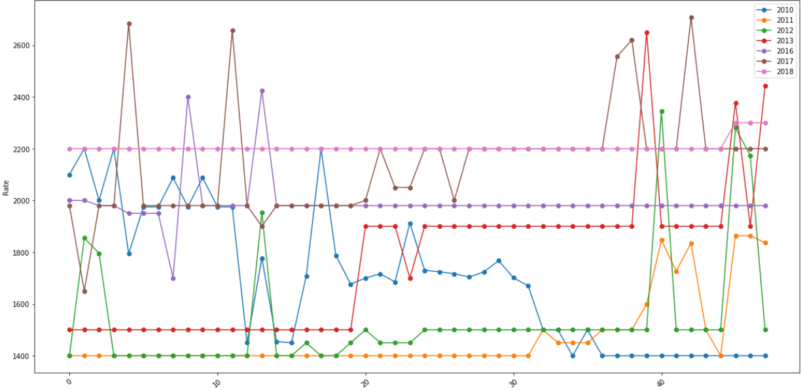

# Sahayata Analysis
Gain insights of crops prices in North Indian wholesale markets using data science.

### Data Scrapping
Data preapred by scrapping open-source government [website](https://fcainfoweb.nic.in/Reports/Report_Menu_Web.aspx) using custom Selenium scripts.

### Data Visualizations
Below are the major data visualizations done for different features of the dataset.

### 1. Average rain per year per month

### 2. Rice rate per week for each year

### Data Predictions

##### lstmWeeklyData.ipynb:
For predciting future price of rice, built a time series model using LSTM.

##### nn.ipynb:
For predicting correct market rate of rice given some input data such as rainfall, inflation, MSP etc. using an ANN model. 

