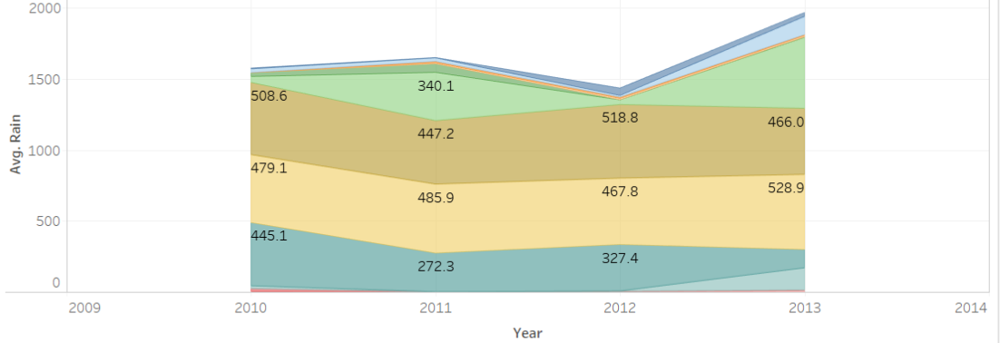
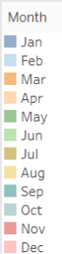

# Sahayata Analysis
Gain insights of crops prices in North Indian wholesale markets using data science.

### Data Scrapping
Data preapred by scrapping open-source government [website](https://fcainfoweb.nic.in/Reports/Report_Menu_Web.aspx) using custom Selenium scripts.

### Data Visualizations
Below are the major data visualizations done for different features of the dataset.

### 1. Average Rain per year per month

 

### lstmWeeklyData.ipynb:
>>In this file, I have transformed the data and made it suitable for a time series model.
>>Created the time series model using LSTM. Plotted its performance using Matplotlib in the same code.
>>persistence_model file is the maximum extent of accuracy the model can touch.

### Tablue
>>This folder contains the tablue charts created for analyzing relationships between different features of the data.
